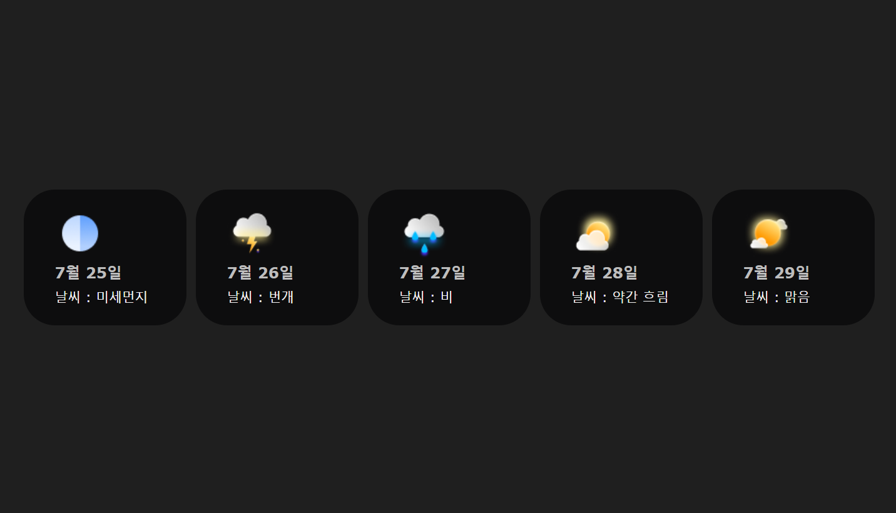

## 리액트를 활용한 컴포넌트 구현 과제

#

### 과제 해결 순서

##### 1. 바닐라 프로젝트 컴포넌트 선정

- 바닐라 프로젝트에서 선정한 TVING 사이트의 콘텐츠 포스터를 컴포넌트로 구현하고자 함

##### 2. figma 디자인 생성

- figma에서 선정한 기능을 컴포넌트로 구현
- figma 시안 작성에 꽤 많은 시간을 투자하게 되어 개발에 시간이 부족하다고 판단
- 컴포넌트 안에 컴포넌트가 있었기 때문에 많은 것을 구현하려한 시도가 아토믹 디자인에선 옳지 않았다고 생각함
- TIVING 컴포넌트 figma 시안 [LINK](https://www.figma.com/design/QNRcSZGoHZn2BFk3YPUbm8/mission01_tving?node-id=5001-101&t=LTtD5BSPASmYXmfp-1)

##### 3. 날씨 아이콘 컴포넌트

- 컴포넌트를 직접 구현해보고 사용해보는 것이 목적이라 생각해 수업시간에 나온 날씨 아이콘을 구현하기로 변경
- status를 통해 날씨에 관련된 상태를 입력받음
- 해당 정보를 사용자가 인식할 수 있도록 p태그와 span태그를 통해 전달(label요소도 삽입했으나 옳게 작동하는지 판단을 하지 못함)
- 날씨 컴포넌트 figma 시안 [LINK](https://www.figma.com/design/r7DlfOn0FBOA0VjtyJaTMl/mission01_Weather?node-id=5001-45&t=fQk4iAx3KOFtkarG-1)

##### 4. 구현 결과

&nbsp;
&nbsp;
&nbsp;

---

## 피드백

### 칭찬

칭찬합니다. 😊

- ✅ 수업 시간에 배운 범위 안에서 노력해주신 점 칭찬합니다.
- ✅ README 작성 내용에 신경써주신 점 칭찬합니다.

&nbsp;

### 조언

조금 다듬으면 더 좋은 결과가 주어질 거에요.

- ⚠️ 주 언어 설정이 한국어인 만큼, 문서 제목도 한국어로 작성해야 합니다.
